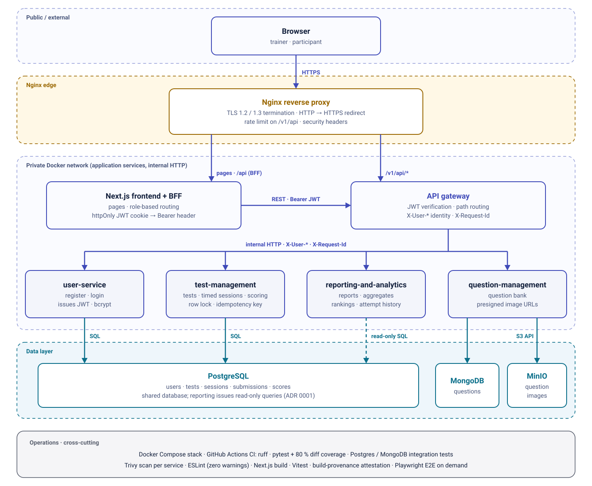

# Rev-Eval Architecture

This document expands the [README](../README.md) overview: request flow, routing, service and data ownership, and the main design decisions. Security controls are in [SECURITY.md](SECURITY.md).

The diagram is generated by [`diagrams/generate_diagrams.py`](diagrams/generate_diagrams.py) (standard library only): `python docs/diagrams/generate_diagrams.py`.

## Request flow

1. **Browser → Nginx (HTTPS).** Nginx is the only container that publishes host ports in the base Compose stack: port 80 returns `301` to HTTPS, port 443 terminates TLS (TLS 1.2 and 1.3; a self-signed certificate is generated on first start by `nginx/docker-entrypoint.sh`).
2. **Nginx → Next.js or the API gateway.** `nginx/nginx.conf` sends `/v1/api/*`, `/health` and `/routes` to the API gateway and everything else (pages, Next.js `/api/*` routes, the dev-server WebSocket) to the frontend.
3. **Next.js BFF → API gateway.** Login (`frontend/src/app/api/auth/login`) calls the gateway, receives the JWT from user-service and stores it in an httpOnly `auth_token` cookie. Browser code calls relative `/api/v1/*` routes; the server-side proxy (`frontend/src/app/api/v1/[...path]`) reads the cookie and calls the gateway with `Authorization: Bearer <token>`. Browser JavaScript never handles the token.
4. **API gateway → services.** The gateway verifies the JWT on every path except login and registration, resolves the owning service from its routing table, and forwards the call over the private Docker network with `X-User-Id`, `X-User-Email`, `X-User-Role` and `X-Request-Id`.
5. **Services → data.** Each service talks to its own store; reporting reads the PostgreSQL database that test-management writes.

## Routing table (API gateway)

| Path prefix under `/v1/api/` | Service |
|------------------------------|---------|
| `auth`, `users` | user-service |
| `tests`, `submissions`, `skills`, `dashboard`, `test-sessions` | test-management-service |
| `questions` | question-management-service |
| `reports` | reporting-and-analytics-service |

`GET /routes` on the gateway returns the same table.

## Services and data ownership

| Service | Responsibility | Store | Container port |
|---------|----------------|-------|----------------|
| `api-gateway-service` | JWT verification, routing, identity and request-ID forwarding | none | 8000 |
| `test-management-service` | Tests, skills, assignments, timed sessions, submissions, scoring | PostgreSQL | 8001 |
| `user-service` | Registration, login (bcrypt), JWT issuance, users | PostgreSQL | 8002 |
| `question-management-service` | Question bank (MCQ, multi-select, true/false, text); image upload/download through presigned URLs | MongoDB, MinIO | 8003 |
| `reporting-and-analytics-service` | Per-test reports, aggregates, per-question statistics, rankings, attempt history | PostgreSQL (read-only queries) | 8004 |
| `frontend` | Next.js pages and the BFF proxy | none | 3000 |

Container ports are reachable only on the Compose network unless the [development override](../README.md#developer-endpoints) is used.

## Scoring, idempotency and locking

Implemented in `services/test-management-service/src/services/quiz_session_service.py`:

- **Scoring.** Single-answer questions are exact match; multi-select questions earn partial credit using Jaccard similarity.
- **Row lock.** A submit loads the session with `SELECT ... FOR UPDATE`, so two concurrent submits for the same session serialize instead of both scoring it (covered by `tests/test_session_lock_postgres.py` against real PostgreSQL).
- **Idempotency.** A submit may carry an `Idempotency-Key` header. Its SHA-256 hash is stored per part (`part_a_idempotency_hash`, `part_b_idempotency_hash`); a retry with the same key returns the stored result, and a different key after the part is finalized is rejected.
- **Timed sessions.** The frontend renders questions polymorphically, runs a timer, autosaves drafts (`PATCH /test-sessions/{id}/draft`) and drives submission with an explicit state machine (`frontend/src/lib/submitMachine.ts`).

## Key design decisions

- **Gateway plus BFF.** The gateway is the single API entry for verification and routing; the Next.js BFF keeps the token in an httpOnly cookie. Trade-off: two hops for browser API calls, in exchange for no token in browser JavaScript.
- **Defence in depth on authorization.** The gateway rejects unauthenticated traffic; user-service, test-management and question-management verify the caller's JWT again and apply their own role and ownership rules (details and remaining gaps in [SECURITY.md](SECURITY.md)).
- **Reporting reads the shared database directly.** Chosen over an HTTP API or an event projection to keep aggregate SQL in the database and avoid N+1 calls; the cost is schema coupling to test-management. See [ADR 0001](../services/reporting-and-analytics-service/adr/0001-direct-db-read.md).
- **Presigned object URLs.** Question images move between client and MinIO through time-limited presigned URLs, so image bytes do not pass through the question service. URLs are signed for the browser-facing origin (`S3_PUBLIC_ENDPOINT_URL`), and Nginx proxies `/question-images/` to MinIO with the original `Host`, because the SigV4 signature covers it.
- **Single private network.** All containers share one Compose bridge network (`backend-net`); only Nginx is published to the host in the base stack.

## Local topology

| Compose file | Publishes |
|--------------|-----------|
| `docker-compose.yml` | Nginx only: `80` (redirect) and `443` |
| `docker-compose.dev.yml` (override) | frontend `3000`, gateway `8000`, services `8001`–`8004`, PostgreSQL `5432`, MongoDB `27017`, MinIO `9000`/`9001` |

The Playwright end-to-end job and `scripts/smoke.sh --direct` use the override's ports.
