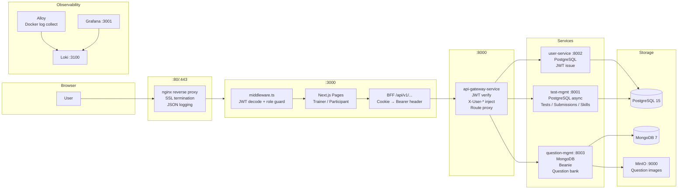

# Project Analysis: rev-eval (Revature Evaluation Platform)

**Date:** 2026-06-11  
**Branch:** jorge-logging  
**Analyst:** Claude Code (automated brownfield analysis)

---

## 1. Executive Summary

rev-eval is a local-first, multi-service assessment platform. Trainers create MCQ-based tests and question banks; participants take tests; the platform tracks submissions and skills. The stack is production-shaped: Next.js 16 BFF frontend, four FastAPI backend microservices, PostgreSQL + MongoDB, MinIO object storage, Nginx reverse proxy, and a full observability stack (Loki + Grafana + Alloy).

CI is active and blocking on lint, coverage, build, and Trivy image scanning. The main risk areas are borderline test coverage on `question-management-service`, a TODO timezone issue in test submissions, and an empty `reporting-and-analytics-service` scaffold.

---

## 2. Repository Map

```
rev-eval/
├── .claude/                    # Claude Code workspace
├── .github/workflows/          # CI pipeline (ci-pipeline.yml)
├── docs/                       # Plans + features + analysis
├── frontend/                   # Next.js 16 app (React 19, TypeScript, pnpm)
├── nginx/                      # Nginx reverse proxy (SSL, JSON logging)
├── observability/              # Loki, Grafana, Alloy stack
├── services/
│   ├── api-gateway-service/    # JWT verification, reverse proxy (port 8000)
│   ├── user-service/           # Auth, user management (port 8002)
│   ├── test-management-service/    # Tests, submissions, skills (port 8001)
│   ├── question-management-service/ # MongoDB question bank (port 8003)
│   └── reporting-and-analytics-service/ # EMPTY scaffold
├── venv/                       # Python virtual environment
├── .env / .env.example         # Runtime environment
├── docker-compose.yml          # Full 11-service orchestration
├── pyproject.toml              # Ruff config (Python 3.11, line 88)
├── CLAUDE.md                   # Project knowledge base
└── README.md                   # Quick start
```

---

## 3. Technologies Used

| Technology | Evidence | Purpose | FDE Notes |
|---|---|---|---|
| Next.js 16 | `frontend/package.json` | React SSR + App Router + BFF | App Router routes in `src/app/`, BFF catch-all at `api/v1/[...path]/` |
| React 19 | package.json | UI rendering | Concurrent features available |
| TypeScript | tsconfig.json | Frontend type safety | Strict mode likely |
| Tailwind CSS v4 | postcss.config.mjs | Styling | `@tailwind` directives |
| shadcn/ui | components.json | UI components | Radix primitives in `src/components/ui/` |
| pnpm 9.15.0 | packageManager field | Frontend package manager | Use `pnpm`, not `npm`/`yarn` |
| Python 3.11 | Dockerfiles | Backend services | pyproject.toml targets 3.11 |
| FastAPI | requirements.txt | HTTP API framework | All 4 backend services |
| SQLAlchemy (sync) | user-service/db/session.py | ORM for user-service | Sync `SessionLocal`; generator `get_db` |
| SQLAlchemy (async) | test-mgmt/db/session.py | ORM for test-management | `AsyncSession`; `get_db` async |
| Beanie ODM | question-mgmt | MongoDB document models | `Question` is `Document`; `init_beanie()` at startup |
| PostgreSQL 15 | docker-compose.yml | Relational DB (user, test-mgmt) | Two services share one PG instance |
| MongoDB 7 | docker-compose.yml | Document DB (questions) | question-management-service only |
| MinIO | docker-compose.yml | S3-compatible object storage | Question images; `src/utils/s3_client.py` |
| JWT (HS256) | auth_service.py, main.py | Authentication tokens | Same `JWT_SECRET` shared by user-service and gateway |
| Nginx | nginx/nginx.conf | Reverse proxy, SSL termination | JSON access logs; routes to `:3000` and `:8000` |
| Docker Compose | docker-compose.yml | Full-stack orchestration | 11 services total |
| Ruff | pyproject.toml | Python linter | F/E/W/I/B rules; blocks CI on failure |
| ESLint | frontend/package.json | TS/TSX linter | `--max-warnings=0` in CI |
| pytest + pytest-cov | requirements-dev.txt | Backend testing | `--cov-fail-under=70` gate |
| Jest + RTL | frontend/package.json | Frontend testing | `pnpm test:ci` in CI |
| Loki 3.5.1 | docker-compose.yml | Log aggregation | Receives from Alloy at `:3100` |
| Grafana 12.0.1 | docker-compose.yml | Log dashboard | `:3001` admin/admin |
| Alloy v1.9.1 | docker-compose.yml | Log collector | Docker socket discovery; ships to Loki |
| Trivy | ci-pipeline.yml | Container CVE scanning | CRITICAL/HIGH → fail CI; SARIF to GitHub Security |
| GitHub Actions | .github/workflows/ | CI/CD | Matrix build for 4 backend services + frontend |
| Zod v4 | frontend/package.json | Frontend schema validation | Form schemas in `lib/schemas/` |
| react-hook-form | frontend/package.json | Form state management | Combined with Zod |
| Recharts | frontend/package.json | Dashboard charts | Trainer charts component |
| jose | frontend/package.json | JWT decode | Client-side cookie decode only (no verification) |

---

## 4. Main Entry Points

| Area | Entry Point | What It Starts | Notes |
|---|---|---|---|
| Full stack | `docker-compose.yml` | All 11 services | Use `docker compose up --build` |
| user-service | `services/user-service/main.py:50` | FastAPI on :8002 | Sync SQLAlchemy |
| test-management-service | `services/test-management-service/main.py:52` | FastAPI on :8001 | Async SQLAlchemy |
| question-management-service | `services/question-management-service/main.py:54` | FastAPI on :8003 | Beanie + MongoDB |
| api-gateway-service | `services/api-gateway-service/main.py:314` | FastAPI on :8000 | JWT verify + route proxy |
| Frontend | `frontend/src/app/layout.tsx` | Next.js on :3000 | App Router root |
| Auth guard | `frontend/src/middleware.ts` | Next.js middleware | Runs on every request |
| BFF proxy | `frontend/src/app/api/v1/[...path]/route.ts` | Catch-all route handler | Lifts cookie → Bearer header |
| CI | `.github/workflows/ci-pipeline.yml` | Matrix build + test | 4 backend + 1 frontend job |
| Docker seed | `services/test-management-service/seed_db.py` | PostgreSQL seed data | `password123` default |
| MongoDB seed | `services/question-management-service/seed_rag_context_questions.py` | MongoDB question bank | Run manually |

---

## 5. System Diagram



**Request flow:**
1. Browser → Nginx (SSL) → Next.js (`:3000`)
2. Next.js middleware decodes `auth_token` cookie (no sig verify), checks expiry + role
3. Data calls go to `/api/v1/*` → BFF catch-all → lifts cookie as `Authorization: Bearer`
4. Gateway verifies JWT with `JWT_SECRET`, injects `X-User-Id/Email/Role` headers
5. Gateway routes to downstream service by URL pattern
6. Downstream service trusts headers (except user-service which re-verifies JWT directly)

---

## 6. Mental Model

Think of this project as an **exam-administration system behind a hotel concierge**.

- **Concierge (Nginx + API Gateway):** All traffic enters here. Nginx handles SSL and logs every request. The gateway checks your ID card (JWT), stamps your request with your identity (X-User-* headers), then sends you to the right department.
- **Front desk (Next.js BFF):** The browser never talks directly to the backend. The Next.js server acts as a trusted proxy — it reads your session cookie and translates it into backend credentials.
- **HR Department (user-service):** Issues ID cards (JWTs), manages accounts.
- **Exam Office (test-management-service):** Creates tests, records who submitted what, tracks skills.
- **Question Library (question-management-service):** Stores MCQ/MULTI/TrueFalse questions with optional images in MinIO.
- **Analytics Office (reporting-and-analytics-service):** Empty. Scheduled for future build.
- **Security cameras (Observability):** Every service logs JSON to stdout. Alloy collects it all and ships to Loki. Grafana shows dashboards.

---

## 7. System Boundaries

### 7.1 User Boundary
- **Owns:** Browser session, auth cookie (`auth_token` httpOnly)
- **Depends on:** Next.js login page, user-service for credential validation
- **Should not cross:** Direct calls to gateway or backend services; cookie is httpOnly for reason
- **Risk:** JWT decoded client-side in `middleware.ts` without verification — trust only for routing hints, not access control

### 7.2 Frontend Boundary
- **Owns:** UI rendering, form validation (Zod), role-based page routing
- **Depends on:** BFF API routes, auth_token cookie, Next.js middleware
- **Should not cross:** Calling gateway directly from browser; embedding JWT_SECRET
- **Risk:** If middleware fails open (bug in decode logic), unauthenticated users could reach protected pages briefly until server action or API call rejects them

### 7.3 API Boundary (Gateway)
- **Owns:** JWT verification, X-User-* header injection, routing table
- **Depends on:** `JWT_SECRET` env var, internal Docker DNS service names
- **Should not cross:** Business logic, DB access
- **Risk:** `ROUTES` list in `main.py:42` must be updated for every new service; easy to forget

### 7.4 Service Boundary
- **Owns:** Business logic, DB access, response schemas
- **Depends on:** X-User-* headers (except user-service), DB containers, MinIO
- **Should not cross:** Inter-service direct DB access; services call user-service HTTP to resolve user records
- **Risk:** test-management-service calls user-service at runtime via HTTP to fetch full user record; adds latency and failure surface

### 7.5 Data Boundary
- **PostgreSQL:** user-service (users table), test-management-service (tests, skills, test_skills, test_submissions)
- **MongoDB:** question-management-service (questions collection)
- **MinIO:** question images only
- **Risk:** Two services share one PG instance but different schemas; no migration tooling detected (Alembic not listed)

### 7.6 Infrastructure Boundary
- **Owns:** Container orchestration (Docker Compose), SSL (Nginx), log aggregation, object storage
- **Risk:** No migrations: tables auto-created at startup via `Base.metadata.create_all` — safe for dev, risky for prod schema changes

### 7.7 Testing Boundary
- **Backend:** pytest with `--cov-fail-under=70`; uses httpx TestClient; no real DB in tests (in-memory or mocked)
- **Frontend:** Jest + RTL; `pnpm test:ci` in CI; minimal coverage
- **Risk:** question-management-service coverage borderline at ~60%; may fail gate on new CI runs

---

## 8. Service and Component Interactions

### Auth Flow (detailed)
```
1. POST /api/auth/login (Next.js API route)
   → frontend/src/app/api/auth/login/route.ts
   → proxies to user-service /v1/api/auth/login
   → user-service verifies password, issues JWT
   → Next.js sets auth_token httpOnly cookie

2. Data request (e.g., GET /api/v1/tests)
   → frontend/src/lib/api/tests.ts calls api.get('/api/v1/tests')
   → frontend/src/app/api/v1/[...path]/route.ts (BFF catch-all)
   → reads auth_token cookie, adds Authorization: Bearer header
   → forwards to api-gateway-service :8000/v1/tests

3. Gateway processing
   → services/api-gateway-service/src/middleware/auth.py
   → verifies HS256 JWT with JWT_SECRET
   → injects X-User-Id, X-User-Email, X-User-Role
   → routes to test-management-service :8001

4. Downstream service
   → services/test-management-service/src/utils/dependencies.py
   → get_current_user_from_headers reads X-User-* headers
   → calls user-service /v1/api/users/{id} to fetch full user record
   → role guard (get_current_trainer / get_current_participant) applied
```

### Cross-Service HTTP Calls
| Caller | Called | Reason |
|---|---|---|
| test-management-service | user-service | Fetch full user record from X-User-Id header |
| question-management-service | user-service | Same pattern |
| api-gateway-service | user-service / test-mgmt / question-mgmt | Route proxy |

---

## 9. Existing Features

| Feature | Status | Main Files | Notes |
|---|---|---|---|
| User registration | Implemented | `user-service/src/v1/routes/auth_route.py:27` | Email + password, bcrypt hash |
| User login / JWT issuance | Implemented | `auth_route.py:48`, `auth_service.py` | HS256 JWT |
| Role-based routing (frontend) | Implemented | `frontend/src/middleware.ts` | TRAINER → `/trainer/`, PARTICIPANT → `/participant/` |
| JWT verification (gateway) | Implemented | `api-gateway-service/src/middleware/auth.py` | X-User-* header injection |
| Test CRUD (trainer) | Implemented | `test-management-service/src/v1/routes/test_route.py` | Create, read, update, delete tests |
| Question CRUD | Implemented | `question-management-service/src/v1/routes/question_routes.py` | MCQ, MULTI, TRUE_FALSE, TEXT |
| Question images (MinIO) | Implemented | `question-management-service/src/utils/s3_client.py` | S3-compatible upload |
| Test submissions | Implemented | `test-mgmt/src/v1/routes/test_submission_route.py` | Participant answers recorded |
| Skills management | Implemented | `test-mgmt/src/v1/routes/skill_route.py` | Skill tags on tests |
| Trainer dashboard | Implemented | `test-mgmt/src/v1/routes/dashboard_route.py`, `frontend/components/trainer/` | Stats, charts |
| MCQ test-taking UI | Implemented | `frontend/src/components/quiz/` | MCQQuestion, MultiQuestion, ProgressHeader, Navigation |
| Assign test to participants | Implemented | `frontend/src/components/trainer/AssignTestModal.tsx` | Modal UI |
| Centralized structured logging | Implemented | `services/*/src/logging_config.py` | JSON logs, trace_id, request middleware |
| Log aggregation stack | Implemented | `observability/` | Loki + Grafana + Alloy + dashboards |
| CI pipeline | Implemented | `.github/workflows/ci-pipeline.yml` | Matrix build, lint, coverage, Trivy |
| Docker Compose full stack | Implemented | `docker-compose.yml` | 11 services including observability |
| Reporting & analytics service | Scaffolded | `services/reporting-and-analytics-service/` | Empty; W2 D10 candidate |

---

## 10. What Is Present

### Frontend
- Next.js App Router with route groups `(dashboard)`, trainer views, participant views
- BFF proxy pattern (catch-all API route, cookie forwarding)
- Auth flow (login, register, logout, me)
- Role-based middleware guard
- Typed API client (`lib/api/client.ts` + domain files)
- Zod form validation (`lib/schemas/`)
- shadcn/ui component library (20+ components)
- MCQ quiz components (progress, navigation, question types)
- Trainer dashboard with Recharts charts
- Audio recorder/player hooks (likely for interview mode)
- Multi-stage Docker build

### Backend
- Four functional FastAPI services with standard structure
- Sync (user-service) and async (test-mgmt, question-mgmt) DB layers
- JWT issue + verify + header injection flow
- Password hashing (passlib/bcrypt)
- MongoDB via Beanie ODM with auto-init
- MinIO S3 client for question images
- Health endpoints on all services
- Seed scripts for both DBs

### Infrastructure
- Full Docker Compose orchestration
- Nginx with SSL termination and JSON logging
- Complete observability stack (Loki, Grafana, Alloy)
- Pre-configured Grafana dashboard

### CI/CD
- Matrix pytest with 70% coverage gate
- Ruff lint (blocking)
- ESLint 0-warnings gate
- Trivy CRITICAL/HIGH image scanning
- Build provenance attestation

---

## 11. What Is Missing or Weak

| Gap | Area | Evidence | Severity |
|---|---|---|---|
| reporting-and-analytics-service | Backend | Empty scaffold | HIGH — entire service missing |
| Test coverage on question-management-service | Testing | ~2 test files, likely ~60% | HIGH — may fail CI gate |
| Timezone-aware timestamps in submissions | Backend | `test_submission_schema.py:30` TODO | MEDIUM |
| Database migration tooling (Alembic) | Backend | Not in any requirements.txt | MEDIUM — schema changes risky in prod |
| Frontend test coverage | Frontend | 5 test files for 98 TS/TSX files | MEDIUM |
| Error handling consistency | Backend | Some services use raw tracebacks | LOW |
| API documentation / OpenAPI export | Backend | Swagger at `/docs` only; no spec artifact | LOW |
| Seed data validation in CI | CI | Seed scripts exist but not run in pipeline | LOW |
| Inter-service HTTP dependency (user-service) | Architecture | test-mgmt + question-mgmt call user-service at runtime | LOW — latency + failure surface |
| Missing rollback strategy for DB auto-create | Infrastructure | `Base.metadata.create_all` at startup | LOW |

---

## 12. Improvement Opportunities

### 12.1 Quick Wins

1. **Pad question-management-service tests**
   - Why: 70% CI gate; currently ~60%; next CI run may fail
   - Risk: Low — add tests for existing happy paths and one error path
   - First step: `pytest --cov services/question-management-service --cov-report term-missing` → identify uncovered lines

2. **Fix timezone TODO in test submissions**
   - Why: Timestamp serialization silently strips timezone; causes subtle bugs in date math
   - Risk: Low — update schema serializer + test
   - First step: `services/test-management-service/src/schemas/test_submission_schema.py:30`

3. **Add frontend test for dashboard redirect logic**
   - Why: middleware.ts role-based redirect is untested; critical auth path
   - Risk: Low
   - First step: Add `middleware.test.ts` with mocked `jose` decodeJwt

### 12.2 Medium Improvements

4. **Add Alembic migration tooling to PostgreSQL services**
   - Why: `Base.metadata.create_all` works for dev but loses schema history; risky for prod upgrades
   - Risk: Medium — requires initial migration from current schema
   - First step: `pip install alembic`, `alembic init` in user-service and test-management-service

5. **Remove inter-service user-fetch at runtime**
   - Why: test-mgmt and question-mgmt call user-service on every authenticated request; adds latency; if user-service is down, all requests fail
   - Risk: Medium — change trust model; rely on X-User-* headers fully
   - First step: Evaluate if `full_name`, `email` (beyond what headers provide) is truly needed

6. **Increase frontend test coverage for quiz flow**
   - Why: MCQ test-taking is the core participant experience; currently untested
   - Risk: Low effort for high value
   - First step: Add tests for `MCQQuestion.tsx`, `ProgressHeader.tsx`

### 12.3 Larger Improvements

7. **Implement reporting-and-analytics-service**
   - Why: W2 D10 planned feature; platform has no analytics output
   - Risk: Medium — new service with own DB, routes, CI integration
   - First step: Define scope (submission aggregates, score distributions, per-skill stats)

8. **Add end-to-end tests (Playwright)**
   - Why: Frontend + backend are separately tested but integration is untested in CI
   - Risk: Medium — requires running stack in CI
   - First step: Docker Compose–based E2E job in CI with Playwright

9. **Rate limiting at gateway**
   - Why: Auth endpoints (login/register) exposed without rate limits; brute-force risk
   - Risk: Low effort at gateway layer
   - First step: Add `slowapi` or Nginx `limit_req_zone` on `/v1/api/auth/*`

---

## 13. Recommended Reading Path for a New FDE

1. `CLAUDE.md` — Architecture overview, auth patterns, DB patterns, service structure
2. `docker-compose.yml` — Understand all service names, ports, dependencies
3. `.env.example` — Understand all required env vars
4. `services/api-gateway-service/main.py` — Routing table, JWT flow, how all requests enter the backend
5. `frontend/src/middleware.ts` — How frontend enforces auth + role routing
6. `frontend/src/app/api/v1/[...path]/route.ts` — BFF proxy pattern
7. `services/user-service/main.py` + `src/services/auth_service.py` — JWT issuance
8. `services/test-management-service/main.py` + routes — Core business domain
9. `services/question-management-service/main.py` — MongoDB + MinIO pattern
10. `services/*/src/logging_config.py` — Logging pattern (replicate in new services)
11. `.github/workflows/ci-pipeline.yml` — What CI checks and how to pass it
12. `observability/` — How to access logs in Grafana during local dev

---

## 14. Useful Commands

```bash
# Full stack
cp .env.example .env
docker compose up --build

# Activate Python venv (Windows)
.\venv\Scripts\activate

# Run individual services
cd services/user-service && uvicorn main:app --reload --port 8002
cd services/test-management-service && uvicorn main:app --reload --port 8001
cd services/question-management-service && uvicorn main:app --reload --port 8003
cd services/api-gateway-service && uvicorn main:app --reload --port 8000

# Backend tests (from service root)
pytest
pytest --cov --cov-report=term-missing
pytest --cov --cov-fail-under=70

# Python lint
ruff check .

# Frontend (from frontend/)
pnpm install
pnpm dev          # :3000
pnpm build
pnpm lint
pnpm test
pnpm test:ci      # with coverage

# Health checks
curl http://localhost:8000/health  # gateway
curl http://localhost:8001/health  # test-mgmt
curl http://localhost:8002/health  # user-service
curl http://localhost:8003/health  # question-mgmt

# Logs (Grafana)
open http://localhost:3001   # admin / admin

# Swagger docs
open http://localhost:8001/docs  # test-mgmt
open http://localhost:8002/docs  # user-service
open http://localhost:8003/docs  # question-mgmt
open http://localhost:8000/docs  # gateway

# MinIO console
open http://localhost:9001   # minioadmin / minioadmin

# Seed data
cd services/test-management-service && python seed_db.py
cd services/question-management-service && python seed_rag_context_questions.py
```

---

## 15. Risks and Caution Areas

| Risk | Severity | Area | Notes |
|---|---|---|---|
| question-management-service below 70% coverage | HIGH | CI | Fix before next feature branch |
| No Alembic migrations | MEDIUM | Database | Schema changes will drop/recreate tables in dev; prod would need manual SQL |
| Timezone stripping in submissions | MEDIUM | Data integrity | `test_submission_schema.py:30` |
| inter-service HTTP chain at auth time | MEDIUM | Reliability | test-mgmt → user-service on every request; adds latency |
| Frontend middleware JWT decode without verification | LOW | Security | Used for routing only; real auth is server-side; document clearly |
| `JWT_SECRET` default in .env.example | LOW | Security | Insecure default; must be rotated in any non-local env |
| ROUTES list in gateway must be updated manually | LOW | Ops | Adding new service requires `main.py` change |
| No E2E tests in CI | LOW | Quality | Integration bugs won't surface until manual testing |

---

## 16. Open Questions

1. What is the planned scope for `reporting-and-analytics-service` (W2 D10)? Which metrics are needed?
2. Is timezone awareness needed for test submissions in production, or is UTC-only acceptable?
3. Should `question-management-service` keep both a MongoDB `question_id` and MongoDB's native `_id`?
4. Is the audio recorder/player (hooks in `frontend/src/lib/hooks/`) connected to an interview mode? Is that planned?
5. Will production run on Docker Compose or a container orchestrator (K8s)?
6. Are there plans for role `ADMIN` to have its own dashboard?

---

## 17. Next Recommended Actions

| Priority | Action | Effort | Impact |
|---|---|---|---|
| 1 | Pad question-management-service tests to 70%+ | Small | Unblocks CI |
| 2 | Fix timezone TODO in test submissions | Small | Data integrity |
| 3 | Add `middleware.test.ts` for auth redirect logic | Small | Covers critical path |
| 4 | Define scope for reporting-and-analytics-service | Medium | W2 D10 readiness |
| 5 | Add Alembic to PostgreSQL services | Medium | Prod-safety |
| 6 | Add rate limiting on auth endpoints at gateway | Medium | Security posture |
| 7 | Add Playwright E2E job to CI | Large | Full integration coverage |
